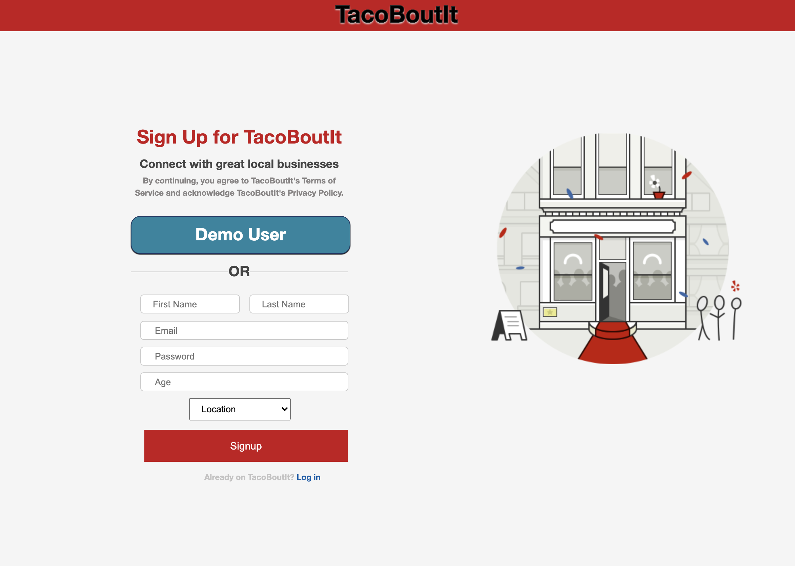
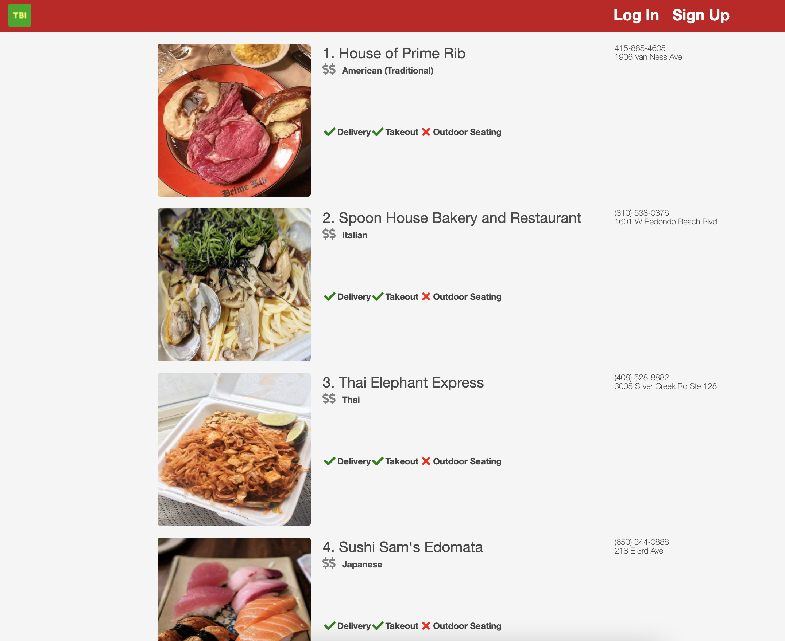
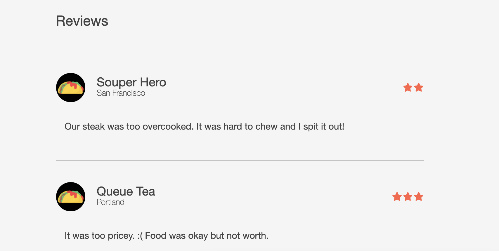

# TacoBoutIt

[Live!](http://tacobout-it.herokuapp.com/#/)

TacoBoutIt is a full-stack clone of Yelp.

I have created functionality such as User Auth, visiting Business pages, viewing Business locations on Google Maps, creating Reviews, and Tagging Reviews

# Technologies Used

| Backend                                                    | Frontend                                                                      |
| ---------------------------------------------------------- | ----------------------------------------------------------------------------- |
| [Ruby on Rails](https://rubyonrails.org/)                  | [React](https://reactjs.org/)                                                 |
| [PostgreSQL](https://www.postgresql.org/)                  | [Redux](https://redux.js.org/)                                                |
| [jbuilder](https://github.com/rails/jbuilder)              | [Google Maps API](https://developers.google.com/maps/documentation/)          |
| [bcrypt](https://rubygems.org/gems/bcrypt/versions/3.1.12) | [FontAwesome](https://fontawesome.com/how-to-use/on-the-web/using-with/react) |
| [AWS S3](https://aws.amazon.com/s3/)                       | [JavaScript ES6](https://www.w3schools.com/js/js_es6.asp)                     |

## Features

1. User Authentication

TacoBoutIt has a User authentication feature which allows them to create their account and have access to the functionality such as creating a review and tagging other reviews as "funny", "useful", or "cool".

In addition to making fields required in the frontend, the attributes are also validated in the `user.rb` model.

```
class User < ApplicationRecord
    attr_reader :password

    validates :email, presence: true, uniqueness: true
    validates :password_digest, :session_token, presence: true
    validates :password, length: { minimum: 6, :message => "Password is too short. Minimum is 6 characters."}, allow_nil: true
    validates :age, :inclusion => { :in => (13..149).to_a, :message => "Must be 13 or older to sign up."}

    after_initialize :ensure_session_token

    has_many :reviews,
    foreign_key: :author_id,
    class_name: :Review

    has_many :tags,
    foreign_key: :author_id,
    class_name: :ReviewTag

    def self.find_by_credentials(email, password)
        user = User.find_by(email: email)
        return nil unless user
        user.is_password?(password) ? user : nil
    end

    def password=(password)
        @password = password
        self.password_digest = BCrypt::Password.create(password)
    end

    def is_password?(password)
        BCrypt::Password.new(self.password_digest).is_password?(password)
    end

    def reset_session_token!
        self.session_token = SecureRandom.urlsafe_base64
        self.save
        self.session_token
    end

    private
    def ensure_session_token
        self.session_token ||= SecureRandom.urlsafe_base64
    end
end
```



2. Business Index + Show Pages

A TacoBoutIt Business Page has set of photos of that is being hosted on `AWS S3`. The `Google Maps API` pinpoints exactly where the restaurant is located based on latitude and longitude coordinates.

A Business Show page contains information about Users, Business, and Reviews making it the main component of the entire the application. The Business show page is the main source of interactions within the application.

```
const mapStateToProps = (state, { match }) => {
  const users = state.entities.users
  const businessId = parseInt(match.params.businessId)
  const business = selectBusiness(state.entities, businessId)
  const reviews = getReviewsForBusiness(state, { businessId })
  return {
    businessId,
    business,
    reviews,
    users,
  }
}
```




3. Reviews (Creating, Reading, Updating, and Deleting)

Users are capable of writing Reviews of Businesses once logged in. A review must have a content and rating value.

The Reviews will get posted up onto the business showpage and only Users of that one unique review are able to delete or edit it.




Reviews are uniquely displayed on their business using a `selector`

```
export const getReviewsForBusiness = (state, ownProps) => {
  return Object.values(state.entities.reviews).filter(
    (review) => review.businessId == ownProps.businessId
  )
}
```

4. Google Maps

The `Google Maps API` is featured both on the Business Index page and Business Show page. With the Business Index page, a `marker_util.js` file is created in combination with the latitude and longitude values of a Business and is respectively shown on the Map.

```
let mapLoc
    if (Array.isArray(this.props.businesses)) {
      mapLoc = {
        center: {
          lat: +this.props.businesses[0].lat,
          lng: +this.props.businesses[0].lng,
        },
        zoom: 10,
        mapTypeControl: false,
        scaleControl: false,
        streetViewControl: false,
        rotateControl: false,
        fullscreenControl: true,
      }
    } else {
      mapLoc = {
        center: {
          lat: +this.props.businesses.lat,
          lng: +this.props.businesses.lng,
        },
        zoom: 10,
        mapTypeControl: false,
        scaleControl: false,
        streetViewControl: false,
        rotateControl: false,
        fullscreenControl: true,
      }
    }

    this.map = new google.maps.Map(this.mapNode, mapLoc)
    this.MarkerManager = new MarkerManager(this.map)
    this.MarkerManager.updateMarkers(this.props.businesses)
```

5. Business Index with Specific Categories

With `selectors`, connecting a container to the Business Index component allowed for easy filters of specific businesses depending on their category such as American, Italian, and Thai.

```
export const getAmericanBiz = (state) => {
  return Object.values(state.entities.businesses).filter(
    (business) => business.category === 'American (Traditional)'
  )
}

export const getItalianBiz = (state) => {
  return Object.values(state.entities.businesses).filter(
    (business) => business.category === 'Italian'
  )
}

export const getThaiBiz = (state) => {
  return Object.values(state.entities.businesses).filter(
    (business) => business.category === 'Thai'
  )
}

export const getJapaneseBiz = (state) => {
  return Object.values(state.entities.businesses).filter(
    (business) => business.category === 'Japanese'
  )
}

export const getChineseBiz = (state) => {
  return Object.values(state.entities.businesses).filter(
    (business) => business.category === 'Chinese'
  )
}

export const getKoreanBiz = (state) => {
  return Object.values(state.entities.businesses).filter(
    (business) => business.category === 'Korean'
  )
}

export const getCofTeaBiz = (state) => {
  return Object.values(state.entities.businesses).filter(
    (business) => business.category === 'Coffee & Tea'
  )
}
```

6. Useful, Funny, Cool

With a `review_tags` table added, Users are able to interact with other Users reviews and classify a review as "useful", "funny", or "cool". From the backend to frontend, creating the association required the 3 tables of `users`, `reviews` and `review_tags`.

Using `componentDidUpdate()` and obtaining the previous properties of a Review Tag, incrementing or decrementing tag counts became available in real time.

```
  componentDidUpdate(prevProps) {
    const { fetchReviews, business, review } = this.props
    let didUpdate =
      this.props.coolSum !== prevProps.coolSum ||
      this.props.usefulSum !== prevProps.usefulSum ||
      this.props.funnySum !== prevProps.funnySum

    if (review.tagCount && prevProps.review.tagCount && didUpdate) {
      fetchReviews(business.id)
    }
  }
```

# Future Ideas

- [x] Update and Delete Reviews
- [x] Categories for Reviews
- [x] Map for Business Index Page
- [ ] Review Count
- [ ] Profile Page for Users

# References

- [Google Maps API](https://developers.google.com/maps/documentation/javascript/overview)

- [Scroll Restoration](https://reactrouter.com/web/guides/scroll-restoration)

- [Font Awesome with React](https://fontawesome.com/how-to-use/on-the-web/using-with/react)
